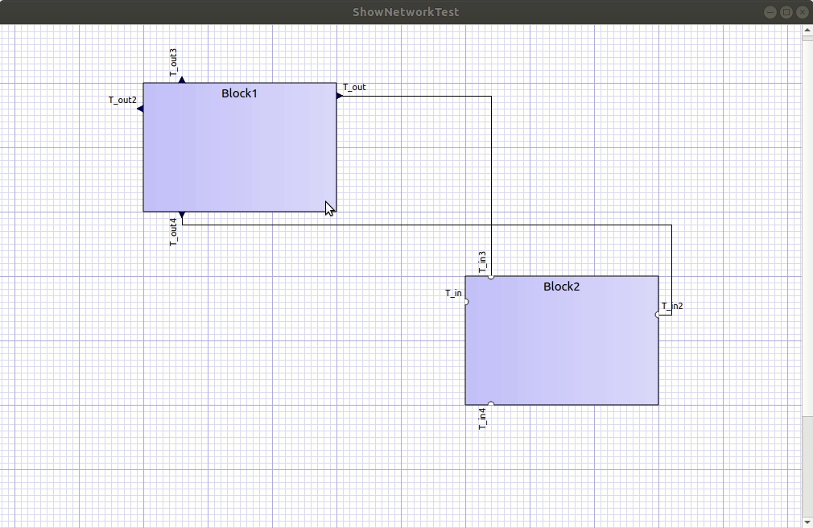

# BlockMod - a C++/Qt library for modelling of block-based networks and connector routing

First take a look at the following animation, which illustrates some of the basic functionality:



## Goals, Vision and Design Requirements

Block-based networks are needed for quite a few applications. When developing such an application, where users are allowed to create their own networks, you may need the following functionality:

- drawing of a network of blocks
- zooming/panning in the view
- showing sockets on the blocks (optionally with their labels)

User interaction:

- selecting/deselecting blocks and connections
- connect blocks by dragging lines from socket to socket
- moving blocks around, hereby keeping the connections and adjusting their geometry automatically

Advanced features:

- defining block geometry and their socket types and positions; when modifying existing blocks keep connections previously made (except when a socket is removed)

## Application Programming Interface

- access/retrieve data structure (the network)
- create/manipulate data structure via API (adding/removing blocks and connectors)
- serialize/deserialize data structure (read/write to xml stream and/or file)

Customizability:

- override default appearance/drawing of blocks, sockets and connectors
- create blocks with additional side effects (e.g. mouse hovering shows auxilliary attributes)

## Auxilliary features

- export view of network as vector graphics image/print to printer/PDF
- adjust style/view options

# Download, building, examples

1. Clone the repository
2. enter the build/cmake directory
3. run `build.sh` or `build_x64.bat` (the scripts set environmental variables for Qt and Visual Studio 2015 on Windows, adjust those as needed before running the scripts)

## Examples

* `SerializationTest` - reads/writes a network from file (in XML format); creates a new network on first run
* `ShowNetworkTest` - Creates a network and displays it in the graphics view
* `BlockModDemo` - A demonstration of all the capabilities of the BlockMod library; block/connector moving, creating/removing connections, adding/removing blocks, ...

# Usage/User Interaction

- Scroll wheel - zoom in/zoom out
- single left click - select block/connector
- CTRL + left click - select multiple blocks (but only one connector can be selected at a time!)
- click and hold left mouse button and drag item - move blocks and connector segments

When in connection mode (started with API call, see below):

- hovering over outlet socket with highlight the socket
- click and hold left mouse button on outlet socket will start a new connection
- drag to free inlet socket (highlights when hovering over) and release mouse button to create connection
- right-click to leave connection mode

# API

## Quick Start

Compile the library (and set include/linker paths accordingly) or copy the BlockMod library source files into your project.

Simple application to show a network.
```c++
// import the SceneManager and ZoomingMeshGraphicsView from BlockMod library
#include <BM_ZoomMeshGraphicsView.h>
#include <BM_SceneManager.h>
#include <BM_Globals.h> // for GridSpacing

// ...

// create network and read from file
BLOCKMOD::Network network;
network.readXML("demo.bm");

// create scene
BLOCKMOD::SceneManager * networkManager = new BLOCKMOD::SceneManager;
networkManager->setNetwork(network); // network is now known and managed by scene manager

// create view and adjust background grid
BLOCKMOD::ZoomMeshGraphicsView * w = new BLOCKMOD::ZoomMeshGraphicsView;
w->setResolution(1);
w->setGridStep(10*BLOCKMOD::Globals::GridSpacing); // align to grid

// set scene and show view
w->setScene(networkManager);
w->show();
```

## Manipulating the network

### Adding/removing blocks

```c++
const double GS = BLOCKMOD::Globals::GridSpacing;

BLOCKMOD::Block b;
b.m_name = "New Block"; // give it a name
b.m_size = QSizeF(5*GS, 10*GS); // size - aligned to grid
b.m_pos = QPointF(20*GS, 5*GS); // position - aligned to grid

// add an inlet socket to the left of the block
BLOCKMOD::Socket s;
s.m_name = "Inlet 1";
s.m_inlet = true;
s.m_pos = QPointF(0, 2*GS);
s.m_orientation = Qt::Horizontal;
b.m_sockets.append(s);

// add an outlet socket to the right
BLOCKMOD::Socket s2("Outlet 2", QPointF(b.m_size.width(), 2*GS), Qt::Horizontal, false);
b.m_sockets.append(s2);

// finally add the block to the managed network
networkManager->addBlock(b);
```

Removing a block can be done via ```SceneManager::removeBlock(...)```.

### Retrieving the network and setting a new network

```c++
// get the network
BLOCKMOD::Network n = networkManager->network();

// set the network
networkManager->setNetwork(n);
```
That's also, how you implement undo/redo functionality. Just take the network after every operation
and store it in an undo action. During an undo, simply swap out the cached and new network.

### Adding/Removing connectors

To add a new connector, create a new connector object ```BLOCKMOD::Connector``` and set name,
source and target socket identifiers. Flat socket identifiers have the format: `<block name>.<socket name>`. Hence, block names **must not have a dot character in the name**. Block names and socket names must match existing blocks/sockets in the network, before you call ```SceneManager::addConnector()```.

Use ```SceneManager::removeConnector(...)``` to remove an existing connector.

### Starting connection mode

In _connection mode_ the scene shows a cross mouse cursor and allows new connections to be made between outlet and inlet sockets.

Call ```SceneManager::enableConnectionMode()``` to put the scene into connection mode.

# Implementation

## Data structure
Data structure `Network` contains `Block` definitions. Each block may have several sockets, either input or output sockets. Sockets may be connected via `Connectors`, which also belong to the network.

Blocks, their sockets and connector can have custom properties, managed by property lists.

The data structure can be serialized in a json/xml representation.

### Visualization

The network is visualized in a QGraphicsView. The SceneManager generates/maintains the scene corresponding to a network. The scene manager provides default functions for generating graphics items for blocks, their sockets and the connectors. These generation functions can be overloaded to generate custom graphics items (with different visual appearance).

Default blocks can be simple rectangles, or svg/png icons. Default sockets are triangles or semi-circles, depending on inlet/outlet types.

The visualization can be switched between _connector-view_ and _connection graph_. The latter will not show sockets, but merely arrows between components with arrow heads indicating data flow direction.

### User Interaction

The framework can handle mouse-move events for blocks. This will automatically move connected connectors as well. Also, the different parts of a connector can be moved as well.

### Data synchronization

When graphics items are moved, the underlying data structure is updated directly (graphics items know their data storage counter parts via pointer links). For example, when moving a block, the connected connector items are modified (and the associated connector data structure as well).

When network is changed in the data structure, e.g. by adding/removing a block, the scene manager synchronizes to the new data structure, hereby only modifying those properties, that have actually changed.


## Implementation

Data members/objects refer to each other via pointer links. Care has to be taken, when modifying vectors/lists so that the pointer links are updated accordingly.

Note: when any of the vectors of the network's data structures change, the memory location of these blocks/connectors may become invalid. Graphics items still pointing to that memory may cause access violations. Thus, any change of network's data structures must yield an update of the respective Graphics items.

Hence, the scene manager also handles any changes to the underlying data structures and provides functions for adding/removing blocks, connectors, sockets etc.
